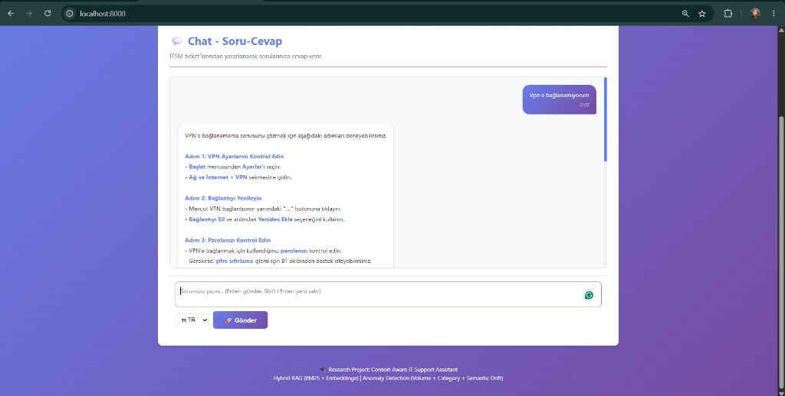
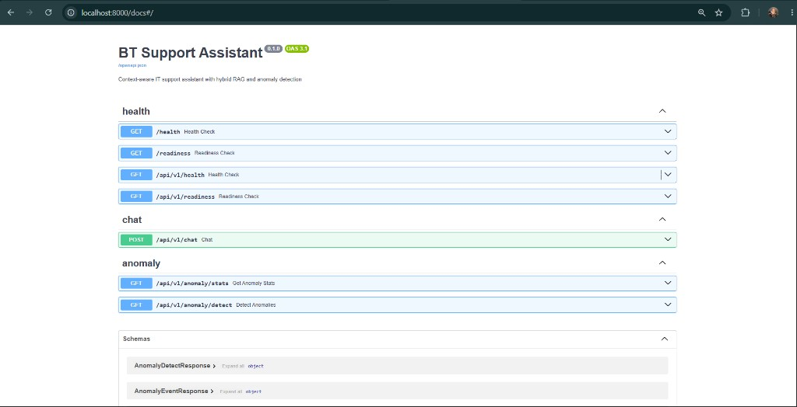
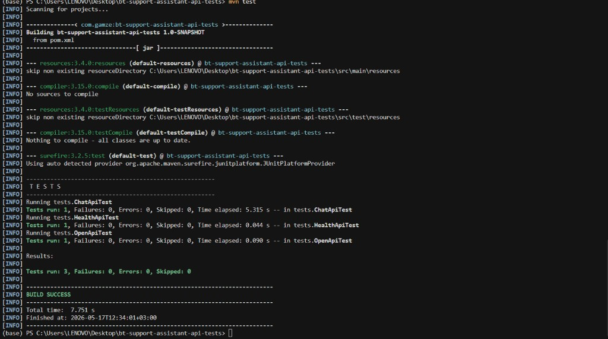

# BT Support Assistant – API Automation Test Project

Automated API regression tests for the [BT Support Assistant](https://github.com/GamzeYarimkulak/bt-support-assistant) backend. This repository contains only the test layer (Java, Maven, JUnit 5, Rest Assured).

The assistant is an AI-supported IT help desk service (hybrid retrieval, confidence scoring, Turkish technical language). For backend architecture and features, see the [main backend repository](https://github.com/GamzeYarimkulak/bt-support-assistant).

---

## Prerequisites

1. **JDK 17 or newer** — the project compiles with `maven.compiler.release=17` (Java 17 bytecode and APIs).
2. **Apache Maven 3.8+**
3. **BT Support Assistant backend** running at `http://localhost:8000` before executing tests.

Start the backend first, then run the automation suite.

---

## Quick Start

### 1. Run the backend

From the backend project:

```bash
python scripts/run_server.py
```

Swagger UI: [http://localhost:8000/docs](http://localhost:8000/docs)

### 2. Run the tests

From this repository:

```bash
mvn test
```

Expected result when the backend is up:

```text
Tests run: 3
Failures: 0
Errors: 0
BUILD SUCCESS
```

Test reports are written to `target/surefire-reports/`.

---

## Project Structure

```text
src/test/java/tests/
├── BaseTest.java      # Rest Assured base URI (localhost:8000)
├── HealthApiTest.java # GET /docs
├── OpenApiTest.java   # GET /openapi.json
└── ChatApiTest.java   # POST /api/v1/chat (JSON body)
```

---

## Automated API Tests

All tests extend `BaseTest` and use the Rest Assured **Given – When – Then** pattern.

| Test class       | Method | Endpoint           | HTTP |
|------------------|--------|--------------------|------|
| `HealthApiTest`  | GET    | `/docs`            | GET  |
| `OpenApiTest`    | GET    | `/openapi.json`    | GET  |
| `ChatApiTest`    | POST   | `/api/v1/chat`     | POST |

### GET `/docs`

**Purpose:** Verify Swagger API documentation is reachable.

**Validations:**

- Status code `200`
- Response time &lt; 5 seconds

### GET `/openapi.json`

**Purpose:** Verify OpenAPI specification is returned.

**Validations:**

- Status code `200`
- JSON field `openapi` is present
- JSON field `info.title` is present
- Response time &lt; 5 seconds

### POST `/api/v1/chat`

**Purpose:** Verify the chat endpoint with a JSON request body.

**Sample request:**

```json
{
  "query": "VPN şifremi unuttum",
  "session_id": "test-session",
  "language": "tr"
}
```

**Validations:**

- Status code `200`
- `has_answer` is `true`
- `confidence` &gt; 0
- Response time &lt; 90 seconds (AI/RAG processing may take longer than documentation endpoints)

---

## Technologies

| Layer        | Stack                                      |
|-------------|---------------------------------------------|
| Automation  | Java 17 (`release`), Maven, JUnit 5, Rest Assured 5.4, Hamcrest |
| Backend (under test) | Python, FastAPI — [bt-support-assistant](https://github.com/GamzeYarimkulak/bt-support-assistant) |

---

## Course Project Alignment

This project fulfills the **Software Test Engineering** API regression assignment requirements:

- Rest Assured with Java / Maven / JUnit 5
- Status code, response body, and response-time assertions
- At least one GET and one POST (POST includes JSON request body)
- Regression-style checks against a running REST service

---

## Screenshots

### Web interface

Chat UI at `http://localhost:8000` (tested indirectly via `POST /api/v1/chat`).



### Swagger documentation

Swagger UI at `/docs` — covered by `HealthApiTest`.



### Maven test results

`mvn test` with backend running on port 8000:

```text
Tests run: 3, Failures: 0, Errors: 0
BUILD SUCCESS
```



---

## Backend repository

Main application (FastAPI, RAG, web UI):

**https://github.com/GamzeYarimkulak/bt-support-assistant**

Clone and start the backend from that repository before running tests in this repo.

---

## Author

Gamze Yarımkulak
